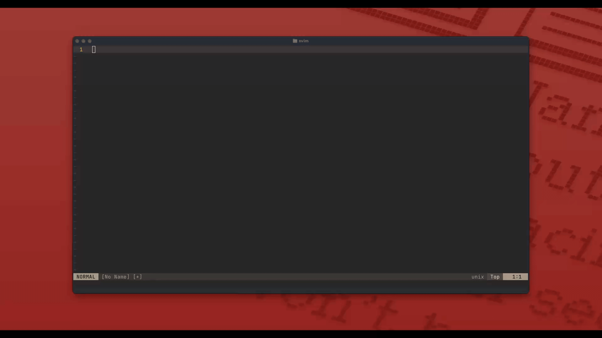
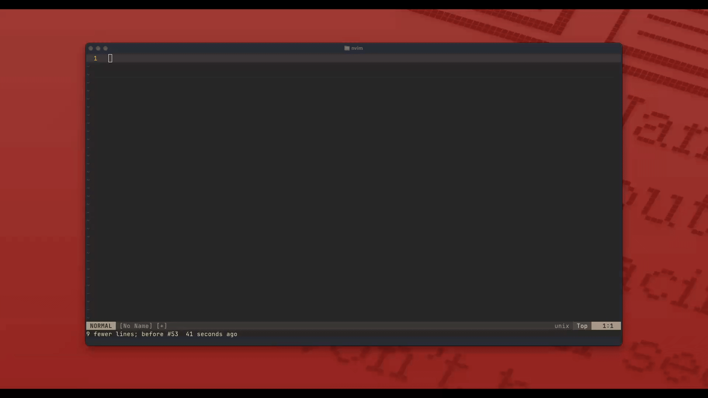
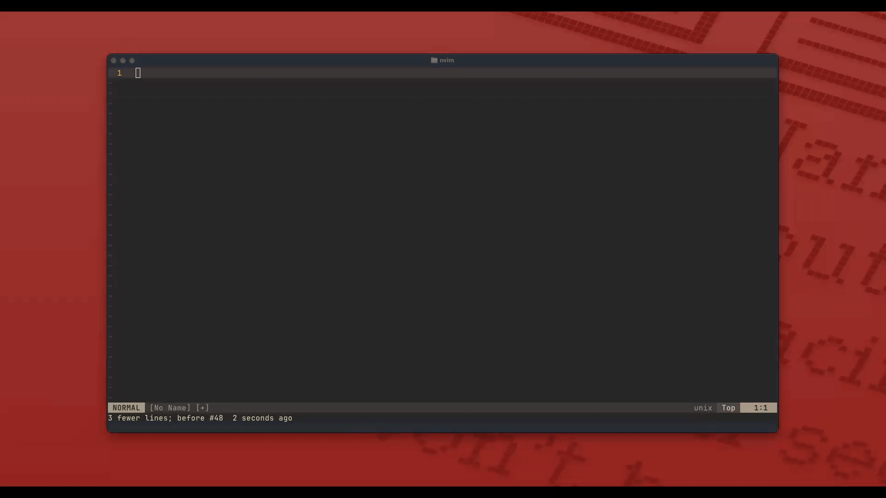
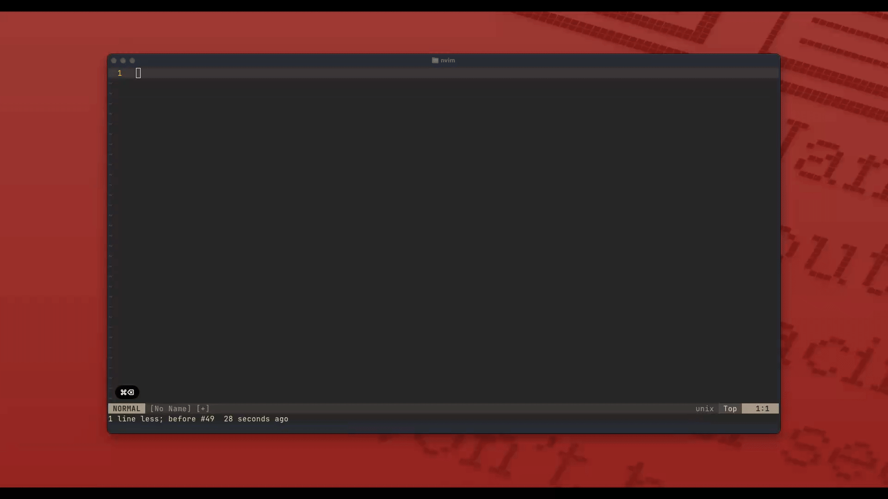
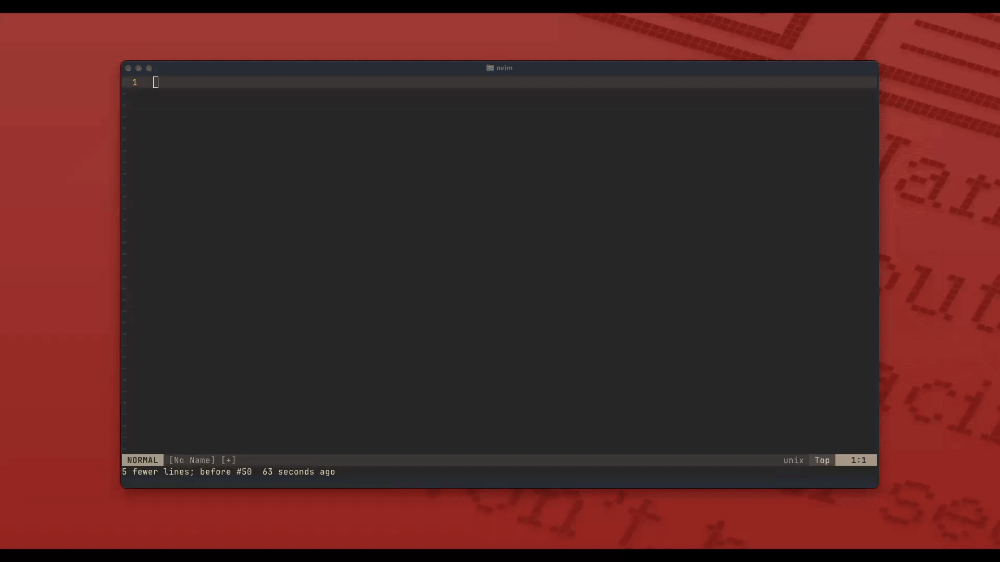

# lorem.nvim

Easily generate dummy text in Neovim

## Installation

### Packer:

```lua
use {
  'derektata/lorem.nvim',
  config = function()
    require("lorem").opts {
      sentence_length = "mixed", -- using a default configuration
      comma_chance = 0.3, -- 30% chance to insert a comma
      max_commas = 2, -- maximum 2 commas per sentence
      debounce_ms = 200, -- default debounce time in milliseconds
    }
  end
}
```

### Lazy:

```lua
return {
  'derektata/lorem.nvim',
  config = function()
    require("lorem").opts {
        sentence_length = "mixed", -- using a default configuration
        comma_chance = 0.3, -- 30% chance to insert a comma
        max_commas = 2, -- maximum 2 commas per sentence
        debounce_ms = 200, -- default debounce time in milliseconds
    }
  end
}
```

## Configuration

The plugin is designed to be as plug-and-play as possible, and therefore no setup is needed as it is shipped with sensible defaults. It is hovewer possible to customize the behavior of the plugin in setup like this:

```lua
require('lorem').opts {
    sentence_length = "mixed",  -- using a default configuration
    comma_chance = 0.3,  -- 30% chance to insert a comma
    max_commas = 2  -- maximum 2 commas per sentence
    debounce_ms = 200, -- default debounce time in milliseconds
}

-- or

require('lorem').opts {
    sentence_length = { -- custom configuration
      w_per_sentence = 8,
      s_per_paragraph = 6
    },
    comma_chance = 0.3,  -- 30% chance to insert a comma
    max_commas = 2  -- maximum 2 commas per sentence
    debounce_ms = 200, -- default debounce time in milliseconds
}
```

#### The `sentence_length` property

This property determines the intervals for how long the sentences of latin words should be before ending them with a period. The following values are available:

| **Value**  | **Words Per Sentence** | **Sentences Per Paragraph** |
| :--------: | :--------------------: | :-------------------------: |
|   short    |           5            |              3              |
|   medium   |           10           |              5              |
|    long    |           14           |              7              |
| mixedShort |           8            |              4              |
|   mixed    |           12           |              6              |
| mixedLong  |           16           |              8              |

#### The `comma_chance` property

This property controls the likelihood of inserting a comma after a word within a sentence. This property allows for the generation of more natural-looking text by adding occasional commas, mimicking the natural pauses in human writing.

#### The `max_commas` property

This property sets the maximum number of commas that can be inserted in a single sentence. This property ensures that sentences do not become overly complex or cluttered with too many commas, maintaining readability and natural flow.

#### The `debounce_ms` property

This property controls how long (in milliseconds) the plugin waits after you stop typing before it expands an inline trigger like `lorem5` or `lorem2p`. By default it’s set to `200`, which strikes a balance between responsiveness and preventing unwanted expansions mid-typing:

* **Lower values** (e.g. `100`)
  * **Pros:** more immediate expansions once you pause
  * **Cons:** may fire prematurely if you type quickly or make corrections

* **Higher values** (e.g. `500`)
  * **Pros:** reduces accidental expansions during fast typing
  * **Cons:** introduces a longer wait before you see the generated text

**Default:** `200`


##### Example configuration

```lua
require('lorem').opts {
  debounce_ms = 300, -- wait 300 ms of inactivity before expanding inline triggers
}
```


## Usage

### `loremX`

This feature allows you to generate a specified number of words of placeholder text directly in the current buffer. Simply type `loremX`, where `X` is the number of words you want, and the plugin will replace the pattern with the generated text.



### `loremXp`

This feature enables the generation of placeholder text in paragraph format. Type `loremXp`, where `X` is the number of paragraphs you want, and the plugin will replace the pattern with the specified number of paragraphs.



### Using the command:

#### Interactive Tab-Completion

The command features tab-completion to help streamline text generation. Start typing `:LoremIpsum` and press `<TAB>` to reveal available options for `mode` (`words` or `paragraphs`). After selecting a mode, pressing `<TAB>` again suggests the appropriate next argument (`<amount>`).





```text
# defaults: 100 words, 1 paragraph
:LoremIpsum <mode> <amount>
                              ┌────────────┐  
                              │            │  
                              │    Menu    │  
                              │depending on│  
                ┌────────────┐│  previous  │  
                │   words    ││ selection  │  
                │ paragraphs ││            │  
                └────────────┘└────────────┘  
━━━━━━━━━━━━━━━━━━━━━━━━━━━━━━━━━━━━━━━━━━━━━━
:LoremIpsum         <TAB>         <TAB>       
                 ┗━━━mode━━━┛ ┗━━━amount━━━┛  
# i.e.
:LoremIpsum words 1000
:LoremIpsum paragraphs 2
```

#### Custom Ipsum

The **Custom Ipsum** feature offers users granular control over the generated text without needing to modify their configuration. By using the `:LoremIpsum` command with specific arguments, users can dynamically specify the format, amount, and structure of the generated text.



Custom usage for paragraphs:
```text
━━━━━━━━━━━━━━━━━━━━━━━━━━━━━━━━━━━━━━━━━━━━━━
     :LoremIpsum  paragraphs  1  10  5        
                       ┃      ┃   ┃  ┃        
         format━━━━━━━━┛      ┃   ┃  ┃        
                              ┃   ┃  ┃        
         amount━━━━━━━━━━━━━━━┛   ┃  ┃        
                                  ┃  ┃        
 w_per_sentence━━━━━━━━━━━━━━━━━━━┛  ┃        
                                     ┃        
s_per_paragraph━━━━━━━━━━━━━━━━━━━━━━┛       
```

#### headless mode:

```bash
# print lorem ipsum words to the terminal
# (default: 100)
nvim --headless -c 'lua print(require("lorem").words())' +qall | tail -n +1

# print 500 words to the terminal
nvim --headless -c 'lua print(require("lorem").words(500))' +qall | tail -n +1

# using the shell script
chmod +x lorem.sh
./lorem.sh -w 10
```
